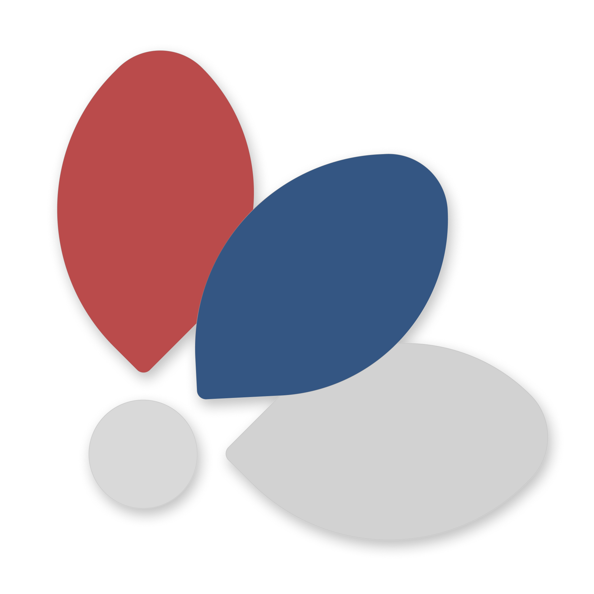
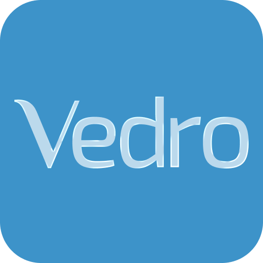

<!-- Typing animation -->
<picture>
  <source media="(prefers-color-scheme: dark)" srcset="https://readme-typing-svg.demolab.com?font=DM+Mono&weight=400&size=22&duration=3500&pause=1000&color=FFFFFF&center=true&vCenter=true&width=520&lines=Hi%2C+I'm+Strahinja;Web+Designer;Founder+of+Learn+Serbian">
  
</picture>

---

### About me

I'm a web designer focused on clean, purposeful interfaces. I founded **[Learn Serbian](https://learn-serbian.rs)** — a project dedicated to making the Serbian language accessible to everyone. I care deeply about typography, whitespace, and the details that make a design feel right.

---

### Currently working on

 **Learn Serbian** — building a better way to learn the Serbian language online.

---

### Skills & tools

---

### Featured projects

<table>
  <tr>
    <td width="64" align="center">
      
    </td>
    <td>
      <strong><a href="https://learn-serbian.rs">Learn Serbian</a></strong> 
      A resource for learning the Serbian language — clean, accessible, and built with care.
    </td>
  </tr>
  <tr>
    <td width="64" align="center">
      
    </td>
    <td>
      <strong><a href="https://github.com/stralej/vedro#readme">Vedro</a></strong> 
      A minimalistic frosted-glass new tab extension. Replaces your browser's default new tab with something you actually want to look at.
    </td>
  </tr>
</table>

---

### Let's connect

---

  ❤️<i> With love, one pixel at a time </i>🟦

